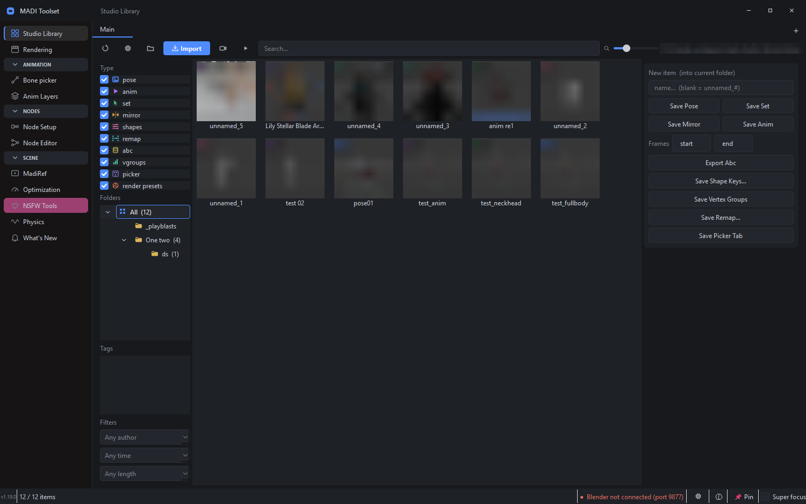

# MadihsonNSFW Toolset

A desktop companion for Blender: a pose and animation library, a render queue
that works with Blender closed, a 2D bone picker, animation layers, PBR maps
from a photo, object sets with one-key isolate, video reference in the
viewport, scene optimisation, texture baking and rig tools — **thirteen tabs**
in one window that talks to Blender over a local connection.

Every tool is free, the source is here under GPL-3.0, and the app makes **no
network connections at all** — no accounts, no sign-in, no telemetry.

[⬇ Download for Windows](https://github.com/MadihsonNSFW/madihsonnsfw-toolset/releases/latest){ .md-button .md-button--primary }
[Install guide](install.md){ .md-button }

/// caption
**Studio Library** — ten kinds of reusable item in one searchable grid. The
previews are blurred in this screenshot; in the app they are your own thumbnails.
///

---

## What it actually is

Two halves that talk to each other:

| Half | What it is | Where it runs |
|---|---|---|
| **The app** | A PySide6 desktop application. Thumbnails, folders, queues, settings — everything with a user interface. | Its own process, its own window |
| **The add-on** | A Blender extension (`madi_anim_library`) that listens on a local port and does the Blender-side work. | Inside Blender |

They speak over TCP on **port 9877**, on your own machine and nowhere else.

!!! info "Why two halves rather than one add-on"
    Blender's interface runs on one thread, and everything you do there
    competes with it — decoding video, scanning a library of 800 thumbnails,
    driving a render queue. Anything heavy enough to be worth doing is heavy
    enough to make Blender stutter while it happens. Putting the interface in
    its own process means the grid can scroll while a 461-bone rig evaluates
    next door.

---

## Start here

1. **[Install](install.md)** — get the app running and the add-on into Blender.
2. **[Connect Blender](connecting-blender.md)** — start the bridge, confirm the
   status bar says what you expect.
3. Open the tab you need below.

---

## The tabs

-   **[Studio Library](tabs/studio-library.md)**

    Ten kinds of reusable item in one searchable grid of thumbnails — poses,
    animations, selection sets, shape keys, Alembic caches and more.

-   **[Rendering](tabs/rendering.md)**

    A render queue that survives a crash, a one-button denoising compositor,
    and render presets covering 164 settings.

-   **[Bone picker](tabs/bone-picker.md)**

    Trace clickable buttons over a reference picture, drawn inside Blender's
    own Image Editor. Layouts live on the armature.

-   **[Anim Layers](tabs/anim-layers.md)**

    Layered animation built on Blender's NLA, plus notes and tags attached to
    timeline markers.

-   **[Node Setup](tabs/node-setup.md)**

    Relink a node's outgoing wires onto another; set up an image sequence
    without typing into file fields.

-   **[Node Editor](tabs/node-editor.md)**

    A node canvas for texture baking, driving Blender's own bake operator.

-   **[Texture Maps](tabs/texture-maps.md)**

    One photo — or a texture already in your scene — becomes a full PBR set:
    normal, roughness, AO, height, metallic, bump and a seamless tile. On your
    own GPU, about six milliseconds a map.

-   **[Organize](tabs/organize.md)**

    Name sets of objects — a rig with its meshes, the lights for a shot — and
    show just one of them with a single press. The sets are saved inside your
    `.blend`. Its second page, **[Rig properties](tabs/rig-properties.md)**,
    lists every custom property a rig carries — Daz morphs, controllers,
    switches — with its value, its keyframes, and one press to key or un-key
    them.

-   **[MadiRef](tabs/madiref.md)**

    Video reference playing in the viewport and in the app at once,
    frame-matched, with drawn notes.

-   **[Optimization](tabs/optimization.md)**

    Camera-measured texture shrinking, managed decimation, quad remeshing, and
    a report of what is making your .blend so big.

-   **[Physics](tabs/physics.md)**

    Spring-driven jiggle on bones — hair, tails, chains — with collision, wind
    and baking.

-   **[NSFW Tools](tabs/nsfw-tools.md)**

    Ready-made geometry-node rigs, built into your scene in one click.

---

## For developers

- **[Building from source](building.md)** — run it from a checkout, build the exe.
- **[The bridge protocol](bridge.md)** — how the two halves talk, and how to add
  a command.
- **[Running the tests](testing.md)** — 89 suites, roughly 4,950 checks.
- **[Contributing](contributing.md)**

---

## Requirements

- **Blender 5.x** (developed against 5.2.0 LTS)
- **Windows** — the app uses Win32 APIs for its window chrome and focus handling

!!! note "The library tab works with Blender closed"
    Importing, organising, tagging and browsing all happen app-side. You only
    need Blender running to save something out of it or apply something into it.
